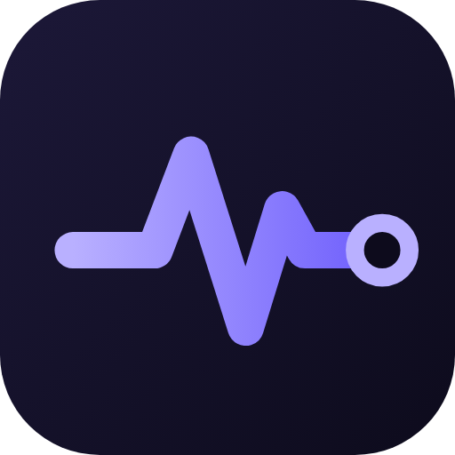
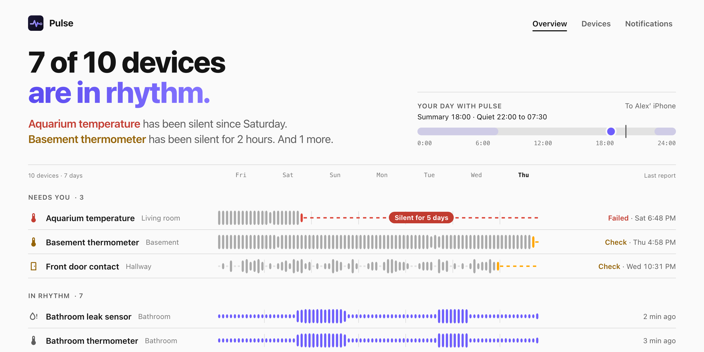
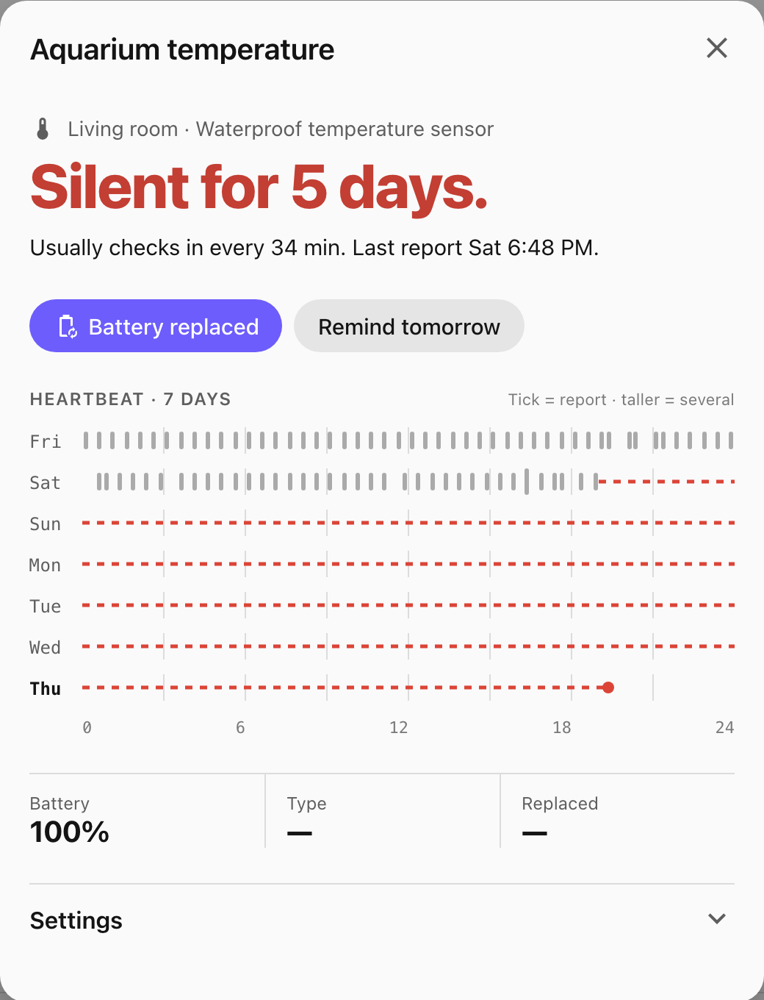
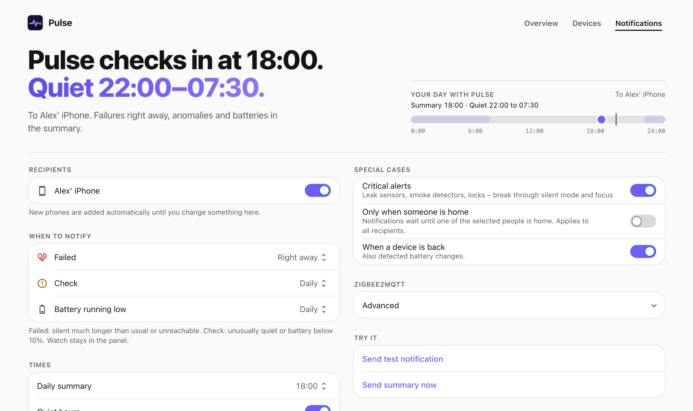
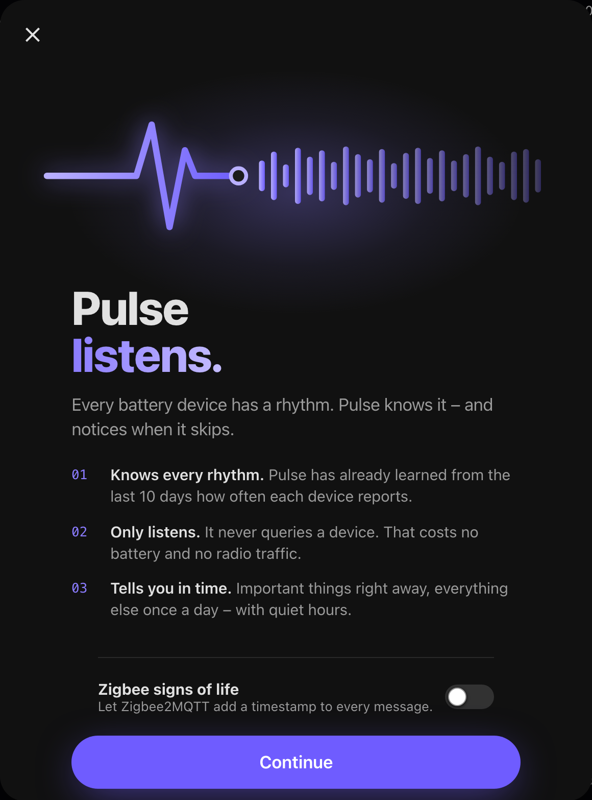
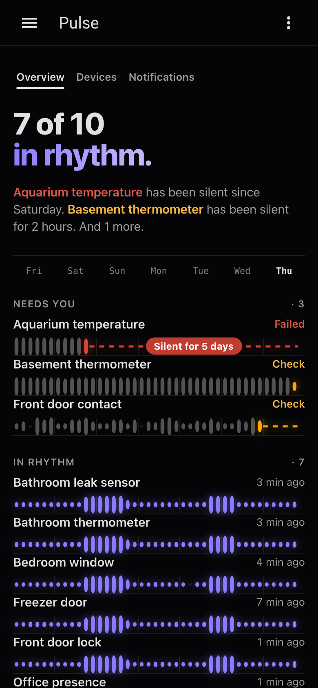

<p align="center"></p>

<h1 align="center">Pulse</h1>

<p align="center"><b>Notices when a battery device goes quiet. Before you do.</b></p>

<p align="center">
  <a href="https://github.com/SH1FT-W/pulse/releases"></a>
  <a href="https://github.com/SH1FT-W/pulse/actions/workflows/ci.yml"></a>
  <a href="https://github.com/SH1FT-W/pulse/actions/workflows/hassfest.yml"></a>
  <a href="https://hacs.xyz"></a>
  <a href="LICENSE"></a>
</p>

<p align="center">
  <picture>
    <source media="(prefers-color-scheme: dark)" srcset="docs/images/overview-dark.png">
    
  </picture>
</p>

A door contact runs out of battery. Home Assistant keeps showing the last state it heard, and the battery
sensor keeps showing 94 %. Nobody notices until an automation misfires a week later.

Pulse is a Home Assistant integration that watches every battery-powered device for you. It learns how often
each device normally reports and tells you when one stops. It only listens and never polls, so it costs no
battery and no airtime.

## What it does

- **Learns the rhythm of every device** from the last ten days of recorder history. No learning week.
- **Status in plain words.** Good, Watch, Check or Failed, always with a reason: *Silent for 5 days. Usually
  reports every 30 minutes.*
- **Ignores restart echoes.** Values that Zigbee2MQTT or Home Assistant replay after a restart never count as a
  sign of life.
- **Zigbee signs of life.** One switch turns on `last_seen` and availability in Zigbee2MQTT, so Pulse also sees
  reports that didn't change a value.
- **Cross-check.** Pair devices that fire together, such as a lock and its door contact. If one keeps reporting
  and the other falls silent, Pulse notices early.
- **Battery changes.** Detects a new battery from a voltage or level jump or a Zigbee re-join, keeps a history,
  knows the battery type of common models and ignores the meaningless percentage of NiMH rechargeables.
- **Notifications you control.** Right away, in a daily summary or off, per level. Quiet hours, critical alerts
  for important devices, "only when someone is home", action buttons in the notification. Never the same message
  twice. When a hub or bridge takes many devices down at once, you get one message instead of forty.
- **Repairs.** Failed devices show up under *Settings → Repairs* and disappear on their own.
- **A panel that reads like a dashboard.** One headline, a seven day rhythm strip per device, a heartbeat calendar
  per device, and the notification settings.

## Installation

[](https://my.home-assistant.io/redirect/hacs_repository/?owner=SH1FT-W&repository=pulse&category=integration)
[](https://my.home-assistant.io/redirect/config_flow_start/?domain=pulse)

1. Click **Open in HACS** above, or add `https://github.com/SH1FT-W/pulse` by hand under HACS → *Integrations* → ⋮ →
   *Custom repositories* (type *Integration*).
2. Install **Pulse** and restart Home Assistant (2026.9 or newer).
3. Click **Add integration** above, or go to *Settings → Devices & services → Add integration → Pulse*. One click.
   Pulse finds your battery devices itself.
4. Open **Pulse** in the sidebar. Admins can change everything, other users see the panel read only.

Pulse monitors every device that has a battery sensor (`device_class: battery`), including devices that only
report "battery low" as on or off. Phones, tablets, vacuums, mowers and devices with power or energy sensors are
skipped on purpose. If a device is missing, check that it has a battery entity and that the entity is enabled.

## How Pulse decides

Pulse needs about seven reports from a device to know its rhythm. With recorder history this is there right away.
Devices the recorder doesn't record start as *Learning*.

From the gaps between reports Pulse learns a typical gap and a longest normal gap. The current silence is compared
with them:

| Status | Normal device | Important device (lock, leak, smoke, gas) |
|---|---|---|
| Watch | 2.5 × typical gap (at least 45 min) | 2 × (at least 30 min) |
| Check | 4 × typical gap (at least 2 h) | 3 × (at least 1 h) |
| Failed | 8 × typical gap (at least 6 h) | 5 × (at least 3 h) |

Unreachable devices (Zigbee2MQTT availability, Matter, entities that are unavailable) become *Check* after
20 minutes and *Failed* after 2 hours (important devices: 10 minutes and 1 hour). A battery at 20 % or less is
*Watch*, at 10 % or less *Check*. NiMH rechargeables are exempt because their percentage says nothing. A device
that only reports "battery low" becomes *Check* when it does.

After *Battery replaced* the silence counts from the replacement, and the device shows "waiting for the first
report" until it reports again.

<p align="center">
  
</p>

## Notifications

Pulse sends to the Home Assistant Companion app (`notify.mobile_app_*`). As long as you don't change the
recipient list, new phones are added automatically.

- **Levels.** *Failed*, *Check* and *Battery* each go right away, in the daily summary, or not at all. Important
  devices send *Check* right away unless it is off.
- **Quiet hours and "only when someone is home"** hold notifications back and deliver them afterwards. Only the
  latest message per device is kept. A device that failed and recovered during the night sends nothing.
- **Critical alerts** break through Do Not Disturb when an important device fails. On iOS the Companion app needs
  permission for critical alerts. On Android they use the `alarm_stream` channel.
- **Buttons** in the notification work for everyone: *Battery replaced* records a replacement, *Remind tomorrow*
  stays quiet for 24 hours.
- **One message for an outage.** If three or more devices go silent in the same minute, Pulse sends a single
  non-critical message naming them, because that is almost always a hub or bridge, not the batteries.
- **The daily summary** waits for quiet hours and for someone to come home. If Home Assistant was down at summary
  time, the summary is sent up to two hours late.

<p align="center">
  
</p>

## Zigbee2MQTT

Pulse listens to `zigbee2mqtt/#` (the base topic can be changed in the panel). With one switch it enables two
bridge options: `last_seen`, a timestamp on every message so Pulse also sees reports without a new value, and
availability. Battery devices send nothing extra. Note that with availability turned on, Home Assistant shows
silent Zigbee devices as unavailable, and Zigbee2MQTT pings mains powered routers.

If the MQTT broker starts later than Home Assistant, Pulse keeps trying every five minutes.

<table>
  <tr>
    <td width="50%" align="center"></td>
    <td width="50%" align="center"></td>
  </tr>
  <tr>
    <td align="center"><sub><b>Welcome</b>: what Pulse does, one switch for Zigbee signs of life</sub></td>
    <td align="center"><sub><b>iPhone</b>: dark mode, the strips glow</sub></td>
  </tr>
</table>

## Entities, events and actions

Per monitored device, attached to the device itself as diagnostic entities:

| Entity | State | Attributes |
|---|---|---|
| `binary_sensor.<device>_pulse_problem` | on for Check or Failed | `status`, `reason_key` |
| `sensor.<device>_pulse_status` | `ok`, `learning`, `watch`, `check`, `failed` | `reason_key`, `silent_since`, `typical_interval` (s), `critical`, `snoozed_until` |
| `sensor.<device>_pulse_last_report` | time of the last report | |

Overall: `sensor.pulse_problems` (count, attribute `devices` with `device_id`, `name`, `status`, `reason_key`,
`reason`) and `sensor.pulse_monitored_devices`. Ignored devices are unavailable.

`reason_key` is one of `ok_rhythm`, `learning`, `silent`, `silent_new`, `unavailable`, `partner`, `battery_low`,
`battery_low_flag`, `battery_soon`, `waiting_first`.

**Events**

- `pulse_device_status_changed`: `device_id`, `name`, `status`, `previous`, `reason`, `reason_key`. Fired when the
  status changes, not for the first evaluation after a start.
- `pulse_battery_replaced`: `device_id`, `name`, `source` (`manual`, `auto` from a voltage or level jump, `announce`
  from a Zigbee re-join after silence).

**Actions:** `pulse.mark_replaced`, `pulse.snooze` (`hours`, 0 cancels), `pulse.ignore`, `pulse.send_test`.

Example: flash a light when an important device fails.

```yaml
triggers:
  - trigger: event
    event_type: pulse_device_status_changed
    event_data:
      status: failed
conditions:
  - condition: template
    value_template: "{{ not trigger.event.data.reason_key.startswith('battery') }}"
actions:
  - action: light.turn_on
    target:
      entity_id: light.hallway
    data:
      flash: long
```

## Privacy

Pulse runs entirely inside your Home Assistant. It reads the recorder, listens to state changes and MQTT, and
sends notifications through the Companion app. Nothing leaves your network.

## Development

```
cd frontend && corepack yarn install && corepack yarn build   # panel → custom_components/pulse/www
python -m pytest -q                                          # needs pytest-homeassistant-custom-component
dev/deploy-test.sh                                           # copy into a Docker test instance
```

`dev/pulse_fake` simulates a Zigbee2MQTT bridge (including `last_seen`, availability, restart echoes and battery
changes) plus a few non-MQTT devices for testing. `dev/seed_store.py` writes ten days of history for them.

Issues and ideas are welcome in the [issue tracker](https://github.com/SH1FT-W/pulse/issues).

License: Apache 2.0
